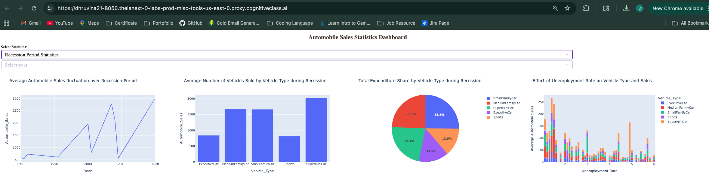
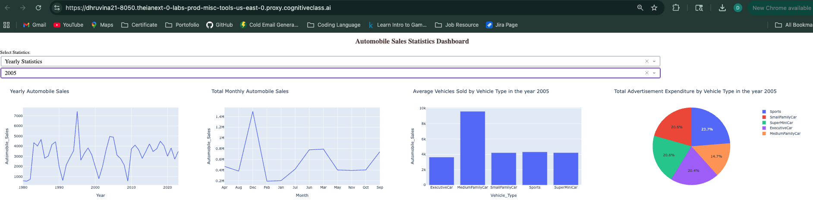

#  Automobile Sales Analysis During Recession Periods

##  Project Overview
As a data scientist for **XYZAutomotives**, this project analyzes historical 
automobile sales data to understand how recession periods impacted vehicle sales 
from 1980 to 2023.

##  Tools & Technologies
| Tool | Purpose |
|------|---------|
| Python | Core programming language |
| Pandas | Data manipulation |
| Matplotlib | Static visualizations |
| Seaborn | Statistical visualizations |
| Plotly | Interactive charts |
| Dash | Interactive dashboard |
| Folium | Geospatial mapping |

##  Project Files
| File | Description |
|------|-------------|
| `DV0101EN-Final-Assign-Part1.ipynb` | Jupyter Notebook with all Part 1 visualizations |
| `DV0101EN-Final-Assign-Part-2-Questions.py` | Dash dashboard application |
| `RecessionReportgraphs.png` | Screenshot of Recession Report dashboard |
| `YearlyReportgraphs.png` | Screenshot of Yearly Report dashboard |

##  Part 1: Data Visualizations
| Task | Description |
|------|-------------|
| 1.1 | Automobile sales fluctuation year over year |
| 1.2 | Advertising expenditure vs sales during non-recession |
| 1.3 | Sales trend per vehicle type (recession vs non-recession) |
| 1.4 | GDP variations during recession vs non-recession |
| 1.5 | Seasonality impact on automobile sales |
| 1.6 | Vehicle price vs sales volume during recession |
| 1.7 | Advertising expenditure during recession vs non-recession |
| 1.8 | Ad expenditure by vehicle type during recession |
| 1.9 | Unemployment rate effect on vehicle sales |

##  Part 2: Interactive Dashboard
Built with **Plotly & Dash** featuring two reports:

### Recession Period Statistics
- Average automobile sales fluctuation over recession periods
- Average vehicles sold by vehicle type
- Total expenditure share by vehicle type
- Effect of unemployment rate on vehicle sales

### Yearly Statistics
- Yearly automobile sales trend
- Total monthly automobile sales
- Average vehicles sold by vehicle type
- Total advertisement expenditure by vehicle type

## 📸 Dashboard Screenshots

### Recession Period Report


### Yearly Statistics Report


## Key Insights
- Automobile sales drop significantly during recession periods
- Executive and Sports cars are most affected during recessions
- SuperMiniCar and SmallFamilyCar remain relatively stable
- Advertising expenditure is significantly higher during non-recession periods
- Higher unemployment rates correlate with lower automobile sales
```

**Commit message:**
```
Update README with complete project documentation
